# Love Live School Idol Festival Tomodachi app

This project is a Love Live School Idol Festival app using data from [School Idol Tomodachi](http://schoolido.lu/)

## Content

The project contains:

- [React Native](https://reactnative.dev/) (v0.63.3)
- [React Navigation](https://reactnavigation.org/) (v5.8.6)
- [Animated TabBar](https://github.com/gorhom/react-native-animated-tabbar) (v2.1.0)
- [React Native Paper](https://callstack.github.io/react-native-paper/) (v4.3.0)
- [apisauce](https://github.com/infinitered/apisauce) (v2.0.0)
- [React Native Firebase](http://rnfirebase.io) (v5.6.0, for push notification)
- [React Native Fast Image](https://github.com/DylanVann/react-native-fast-image) (v8.3.3)
- [React Native Image Viewing](https://github.com/jobtoday/react-native-image-viewing) (v0.2.0)
- [React Native Sentry](https://sentry.io) (v1.9.0)
- [React Native Offline](https://github.com/rgommezz/react-native-offline) (v5.7.0)
- [React Native Vector Icons](https://github.com/oblador/react-native-vector-icons) (v7.1.0)
- [React Native Version Number](https://github.com/APSL/react-native-version-number) (v0.3.6)
- [React Native Async Storage](https://react-native-async-storage.github.io/async-storage/) (v1.13.2)
- [react-native-modalfy](https://colorfy-software.gitbook.io/react-native-modalfy/) (v2.1.0)
- [dayjs](https://day.js.org/) (v1.9.5)
- And more...

## Directory layout

- [`App/Components`](App/Components): presentational components
- [`App/Config`](App/Config): configuration of the application
- [`App/screens`](App/screens): application's screens
- [`App/Context`](App/Context): react context
- [`App/hooks`](App/hooks): custom react hooks
- [`App/Images`](App/Images): images used by the application
- [`App/modals](App/modals): modals
- [`App/Services`](App/Services): application services, e.g. API clients
- [`App/Theme`](App/Theme): base styles for the application
- [`App/Utils`](App/Utils): some utility tools

## Requirements

- Node 8 or greater is required.
- Development for iOS requires a Mac and Xcode 11 or up, and will target iOS 10 and up.

Know about [React Native](https://reactnative.dev).

## Running the project

Assuming you have all the requirements installed, you can setup and run the project by running:

- `yarn install` or `npm i` to install the dependencies
- `react-native run-android` to run the Android application (remember to start a simulator or connect an Android phone)
- `react-native run-ios` to run the iOS application (remember to start a simulator or connect an iPhone phone)

## Review

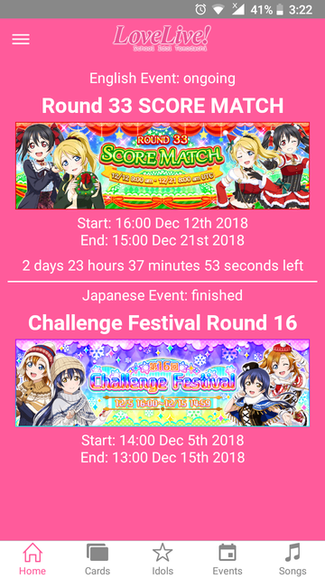
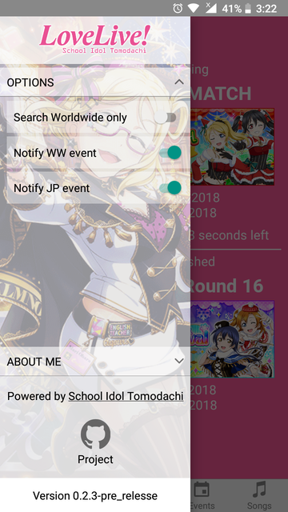
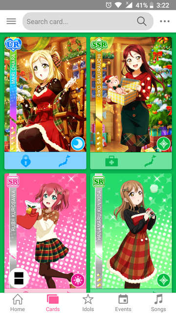
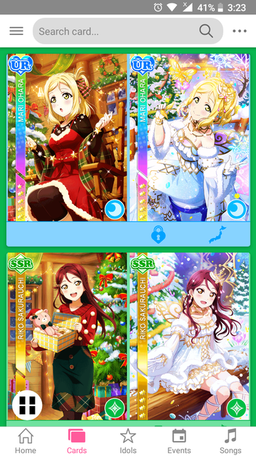
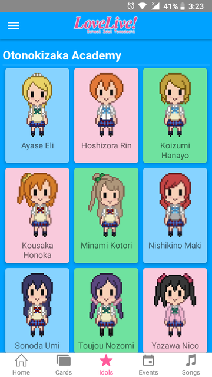
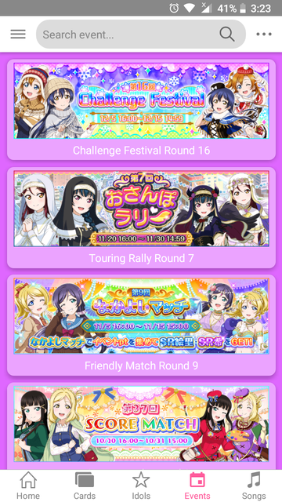
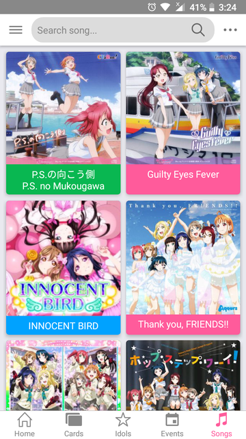
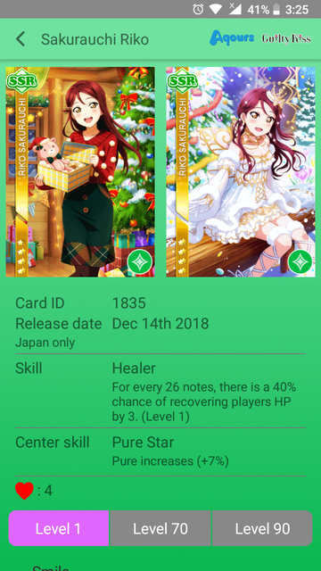
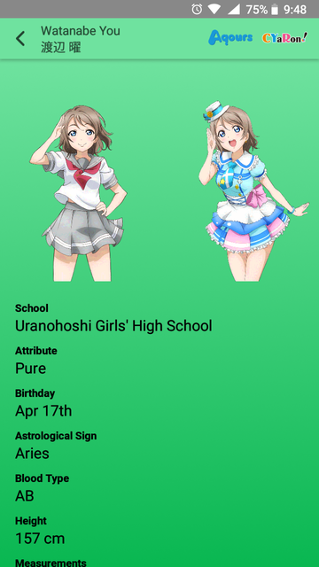
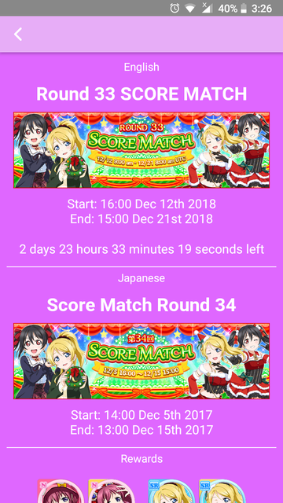

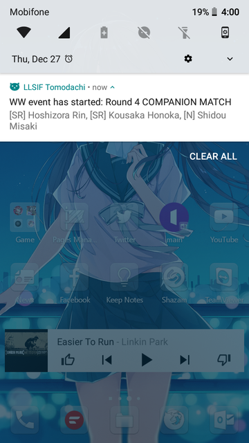

## WIP:

- Dark mode.

## Author

Phạm Ngọc Thạch

I'm a React Native developer, play Love Live, BanGDream, Starlight everyday.

## License

© Phạm Ngọc Thạch

This project is released under the [MIT License](LICENSE).

## Version up

`yarn run version:up -- --major || --minor || --patch`
