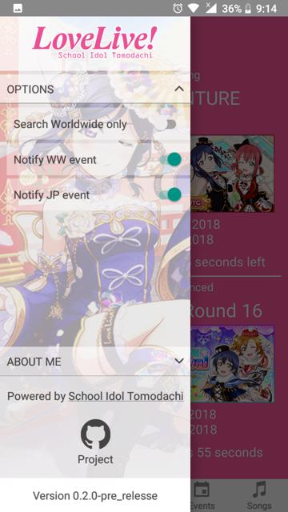
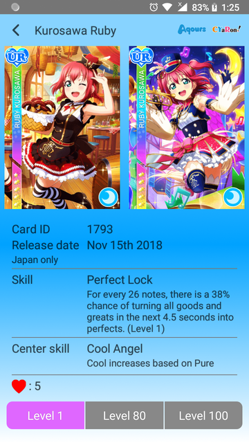

# Love Live School Idol Festival Tomodachi app

This project is a Love Live School Idol Festival app using data from [School Idol Tomodachi](http://schoolido.lu/)

## Content

The project contains:

- [React Native](https://facebook.github.io/react-native/) (v0.57.7) (in "[ejected](https://github.com/react-community/create-react-native-app/blob/master/EJECTING.md)" mode)
- [Redux](https://redux.js.org/) (v3.7.2)
- [Redux Persist](https://github.com/rt2zz/redux-persist) (v5.9.1)
- [Redux Sagas](https://redux-saga.js.org) (v0.16.2)
- [React Navigation](https://reactnavigation.org/) (v2.18.2)
- [reduxsauce](https://github.com/infinitered/reduxsauce) (v1.0.0)
- [apisauce](https://github.com/infinitered/apisauce) (v1.0.0)
- [react-native-firebase](http://rnfirebase.io) (v5.1.1, for push notification)
- [react-native-fast-image](https://github.com/DylanVann/react-native-fast-image) (v5.1.1)
- [react-native-image-gallery](https://github.com/archriss/react-native-image-gallery) (v2.1.5)
- [react-native-picker-select](https://github.com/lawnstarter/react-native-picker-select) (v5.1.0)
- [react-native-sentry](https://sentry.io) (v0.39.1)
- [react-native-linear-gradienet](https://github.com/react-native-community/react-native-linear-gradient) (v2.4.3)
- [react-native-offline](https://github.com/rgommezz/react-native-offline) (v3.14.1)
- [react-native-indicators](https://github.com/n4kz/react-native-indicators) (v0.13.0)
- [moment](https://momentjs.com/) (v2.22.2)
- [react-native-vector-icons](https://github.com/oblador/react-native-vector-icons) (v5.0.0)
- [react-native-version-number](https://github.com/APSL/react-native-version-number) (v0.3.5)
- [react-native-version-up](https://github.com/gustarus/react-native-version-up) (v1.0.9)

## Directory layout

- [`App/Components`](App/Components): presentational components
- [`App/Config`](App/Config): configuration of the application
- [`App/Containers`](App/Containers): container components, i.e. the application's screens
- [`App/Images`](App/Images): images used by the application
- [`App/Sagas`](App/Sagas): redux sagas
- [`App/Services`](App/Services): application services, e.g. API clients
- [`App/Stores`](App/Stores): redux [actions, reducers and stores](https://redux.js.org/basics)
- [`App/Theme`](App/Theme): base styles for the application
- [`App/Utils`](App/Utils): some utility tools

## Requirements

Node 8 or greater is required. Development for iOS requires a Mac and Xcode 9 or up, and will target iOS 9 and up.

You also need to install the dependencies required by React Native:

- for [Android development](https://facebook.github.io/react-native/docs/getting-started.html#installing-dependencies-3)
- for [iOS development](https://facebook.github.io/react-native/docs/getting-started.html#installing-dependencies)

## Running the project

Assuming you have all the requirements installed, you can setup and run the project by running:

- `yarn install` or `npm i` to install the dependencies
- `react-native run-android` to run the Android application (remember to start a simulator or connect an Android phone)
- `react-native run-ios` to run the iOS application (remember to start a simulator or connect an iPhone phone)

## Review

## Author

Phạm Ngọc Thạch

Email: [thachxyz123@gmail.com](mailto:thachxyz123@gmail.com)

I'm a React Native developer, play Love Live and BanG Dream everyday.

## TODO

- Sort option in filter
- Handle offline mode
- Official name

## License

© Phạm Ngọc Thạch

This project is released under the [MIT License](LICENSE).

## Version up

`npm run version:up -- --major || --minor || --patch`
